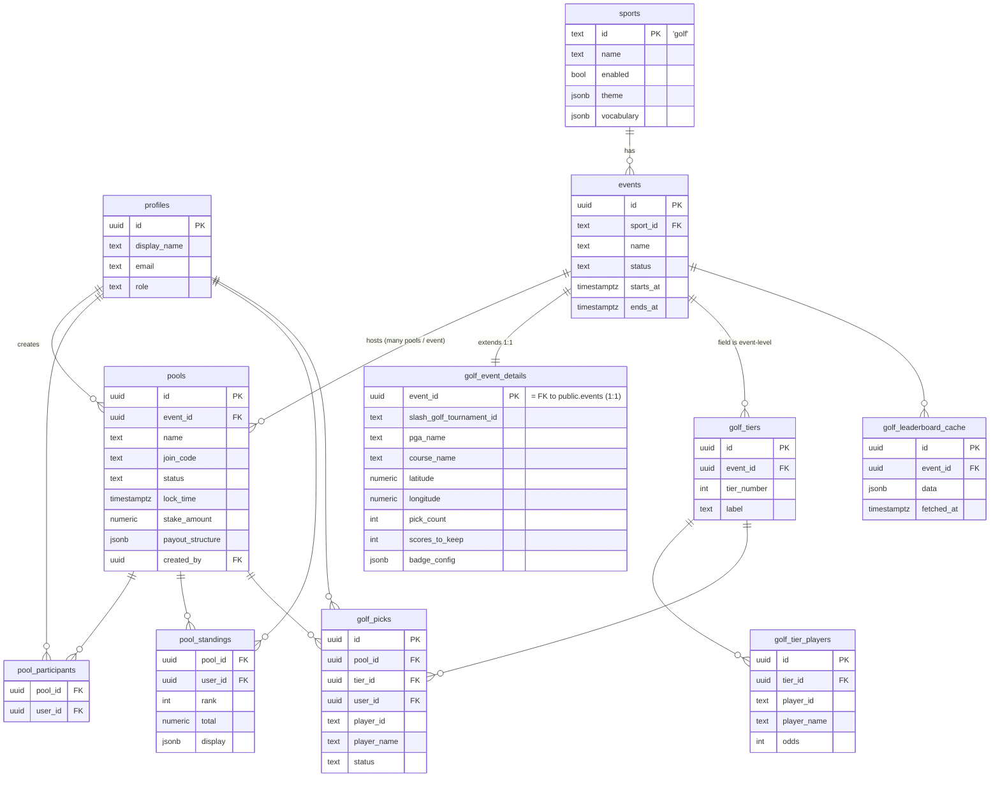
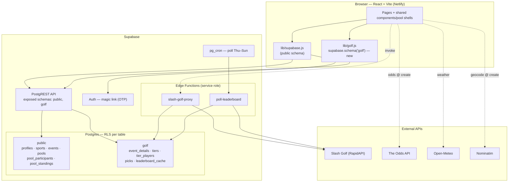

# Multi-Sport Migration — Execution Plan

> **Status:** Planning / aligned, not yet executed. Working reference.
> **Last updated:** 2026-06-24
> **Scope guard:** This is seam work only. The only active sport is **golf**, and golf
> behavior stays unchanged. We are removing golf-as-an-assumption from shared schema,
> shared components, and shared logic so that adding a second sport later is **additive
> work, not a refactor**. No NFL tables, no sport-adapter registry, no multi-sport UI
> are built now.

---

## Decisions that drive this plan

**D1 — Team sports use a game-winner / spread format, not tiered athlete picks.**
The golf `picks → tier → competitor` shape is golf's contest shape, *not* a generic
one. It is not generalized and not forced onto team sports. A future NFL would model
`weeks → games → picks(spread)` independently in its own schema.

**D2 — Per-schema architecture: thin shared core in `public`, full modeling freedom per sport.**
Rather than one schema with branching logic, each sport owns a Postgres schema below
the pool level. `public` holds only what every sport shares.

**D3 — Multiple pools per event (keep the door open).**
A real-world tournament can host multiple independent pools (e.g. a free office pool
and a high-stakes pool on the same US Open), each with its own leaderboard and join
code. Golf today still renders as **one pool per event**; the capability is wired into
the seams but not surfaced in the UI yet.

**D4 — Player-facing vocabulary: "Pool".**
Players join a **Pool**; the **event** ("2026 U.S. Open · Shinnecock Hills") is shown
as context underneath. Pool = the contest; event = the real-world tournament.

---

## Architecture defaults (owned, not open questions)

- Generic `public.pool_standings` cache (normalized `rank / total / display`) that golf
  logic populates, so shared UI renders standings without sport knowledge.
- `scores_to_keep` / `pick_count` live in the golf schema; golf hands the standings UI a
  ready-made subtitle (the "Best 5 of 8" string), so shared UI never reads golf params.
- `public.pool_participants` (generic membership) so core RLS/standings never reach into
  golf's tables.
- Internal table naming as below; `/demo` stays golf-only and unchanged; `api_usage`
  stays generic in `public`; edge-function updates ride in the same PR; one prod
  dashboard setting (Exposed Schemas) is handled via a manual checklist at cutover.

---

## Revised schema

Every FK points **within `public`** or **`golf → public`**. `public` never references a
sport schema. `public.events` is the hinge that lets multiple pools share one tournament.

```
public  (thin shared core — sport-agnostic)
├── profiles            id, display_name, role, status, email
├── sports              id('golf'), name, enabled, theme jsonb, vocabulary jsonb
├── events              id, sport_id → sports, name, status, starts_at, ends_at   ← the hinge
├── pools               id, event_id → public.events, name, join_code, status,
│                       lock_time, stake_amount, payout_structure, created_by      ← many pools per event
├── pool_participants   pool_id → pools, user_id → profiles
└── pool_standings      pool_id → pools, user_id, rank, total, display jsonb, updated_at

golf  (owns golf's full contest structure)
├── event_details       event_id → public.events (1:1), slash_golf_tournament_id,
│                        pga_name, course_name, latitude, longitude,
│                        scores_to_keep, pick_count, badge_config jsonb, status
├── tiers               id, event_id → public.events, tier_number, label           ← field is event-level
├── tier_players        id, tier_id → golf.tiers, player_id, player_name, odds
├── picks               id, pool_id → public.pools, tier_id → golf.tiers,
│                        user_id → public.profiles, player_id, player_name, status
└── leaderboard_cache   id, event_id → public.events, data jsonb, fetched_at        ← one poll serves all pools on the event
```

### Why this shape
- **`public.events` hinge:** D3 requires many pools to reference one event; since the
  core can't reach into `golf`, the event's generic identity must live in `public`. Golf
  extends it 1:1 via `golf.event_details`.
- **Field is event-level:** all pools on the same tournament share one set of
  `tiers`/`tier_players` — no duplication.
- **Leaderboard is polled once per event,** not per pool — eases the Slash Golf monthly
  cap when pools-per-event ships.

### Source mapping (today → target)
- `tournaments` **splits**: generic pool config → `public.pools`; golf event detail
  (`slash_golf_*`, `pga_name`, `course_name`, lat/lon, `scores_to_keep`, `pick_count`)
  → `golf.event_details`; generic event identity → `public.events`.
- `tiers`, `tier_players`, `picks`, `leaderboard_cache` → `golf.*`.
- `pga_event_badges` → folds into `golf.event_details.badge_config`.
- `stake_amount` / `payout_structure` stay in `public.pools` (money pool is generic).
- `api_usage` stays in `public` (generic provider usage).

### Forward flag
`scores_to_keep` sits in `golf.event_details` for now. If two pools on the same
tournament ever need *different* scoring rules, that one field moves to a golf
pool-config row — additive, not a refactor.

---

## Diagrams (target state)

> Legend: entities prefixed `golf_` live in the **`golf`** schema; all others live in
> **`public`**. Every relationship line crosses *within* `public` or points
> **`golf → public`** — `public` never references a sport schema.

### ERD



Key reads from the ERD:
- **`events` is the hinge:** many `pools` point at one `event`, so multiple pools share a
  real tournament. Golf extends each event 1:1 via `golf_event_details`.
- **The golf field is event-level:** `golf_tiers` / `golf_tier_players` hang off `events`,
  so every pool on the same tournament shares one field — no duplication.
- **`golf_leaderboard_cache` is per-event:** one poll of the live leaderboard serves every
  pool on that event.
- **`golf_picks` is the only place pool + field meet:** a pick references its `pool` (which
  contest) and its `tier` (which selection).

### Infrastructure



Infrastructure notes:
- **`lib/golf.js` is the new client seam** — the only place that calls
  `supabase.schema('golf')`, so schema access lives in one file.
- **Exposed schemas** (`public, golf`) is a PostgREST setting in `config.toml` *and* the
  prod dashboard — not captured by migrations. Must be flipped at cutover.
- **Edge functions use the service role** (bypass RLS) but still schema-qualify golf
  tables; `poll-leaderboard` reads `golf.event_details` joined to `public.pools` for which
  events to poll, and writes `golf.leaderboard_cache`.
- Unchanged from today: external API wiring, magic-link auth, pg_cron cadence.

---

## Supabase cross-schema RLS & auth boundaries

**RLS works cleanly across schemas.** It is per-table and schema-independent;
`auth.uid()` / `auth.role()` / JWT claims resolve identically anywhere. Cross-schema
FKs and cross-schema policy subqueries (e.g. `golf.picks` checking
`public.pools.lock_time`) are fully supported. The C1/C2 pick-integrity + post-lock
privacy policies port over unchanged except for schema-qualified names.

**The real risks are plumbing, not RLS logic:**

| Boundary issue | Detail | Mitigation |
|---|---|---|
| Exposed schemas | PostgREST only serves schemas in its exposed list (default `public`). `golf` is invisible to the JS client until added. **This is a dashboard / `config.toml` setting, not a migration** → environment-drift + deploy-coupling risk. | `[api] schemas = ["public","golf"]` in `config.toml` *and* the prod API setting; treat as a cutover step. |
| Role grants | New schemas don't inherit `public`'s grants. `anon`/`authenticated` need `USAGE ON SCHEMA golf` + per-table privileges, or "permission denied" fires *before* RLS runs. | `GRANT USAGE` + `ALTER DEFAULT PRIVILEGES IN SCHEMA golf` in the migration. |
| Client schema switch | JS must call `supabase.schema('golf').from(...)`. Forgetting silently hits `public`. | Wrap golf access in one `lib/golf.js` helper. |
| Cross-schema nested embeds | Existing deep selects (`tournaments→tiers→tier_players`, `picks→profiles,tiers`) now cross the public/golf boundary. PostgREST *can* embed across exposed schemas via FK, but it's the most fragile piece. | Validate in the Phase 0 spike. Fallback: split into separate queries (code already uses `Promise.all`) or a `SECURITY DEFINER` RPC returning the joined shape. |
| SECURITY DEFINER search_path | `is_admin()` / `admin_list_users()` live in `public`; golf policies calling them need `search_path` pinned. | Keep helpers in `public`, `SET search_path = public`, grant EXECUTE. |
| Layering inversion | Today `public.profiles` RLS reads `picks` to expose participant names; if picks move to `golf`, core RLS would reach into a sport schema. | Base profile-visibility + standings on `public.pool_participants`. |
| Edge functions | `poll-leaderboard` / `slash-golf-proxy` use service role (bypass RLS) but still need schema-qualified access; poll now reads `golf.event_details` joined to `public.pools` for active events. | Update functions to `.schema('golf')`; verify service-role grants on golf schema. |

---

## Phased execution (incl. golf data migration)

Live data is tiny (9 tournaments, 72 tiers, 1003 tier_players, 192 picks, 7 cache rows,
21 profiles), so risk is low. Every phase ships **frontend to `main` before the coupled
prod migration**, and is **additive-then-cleanup, never destructive in one deploy.**

- **Phase 0 — Spike (no schema change).** Prove cross-schema embedding + grants on a
  throwaway `golf` schema with one table. Decide embed-vs-split-query now; it shapes the
  frontend work. **Gate the whole plan on this.**
- **Phase 1 — Create core + golf schema, additive.** Add `public.sports` (seed `golf`),
  `public.events`, `public.pools.event_id`, `pool_participants`, `pool_standings`; create
  `golf` schema + grants + `config.toml` exposure. Nothing reads new structures yet.
- **Phase 2 — Backfill, preserving PKs.** Copy into `golf.event_details / tiers /
  tier_players / picks / leaderboard_cache` and populate `public.events` + `public.pools`
  + `pool_participants` from existing rows. **Carry the same UUIDs** so every downstream FK
  stays valid — this is the linchpin. Keep old `public` tables intact as the live source
  until frontend cuts over.
- **Phase 3 — Port RLS + helpers** onto golf tables; repoint `public.profiles` visibility
  + standings to `pool_participants`.
- **Phase 4 — Frontend cutover.** Route golf reads/writes through `.schema('golf')`; split
  any embeds the spike flagged; move golf strings/theme into `sports` / `event_details`.
  Ship to `main`, **then** flip prod Exposed Schemas, **then** run the cutover migration.
- **Phase 5 — Cleanup.** Drop legacy `public.tournaments / tiers / tier_players / picks /
  leaderboard_cache / pga_event_badges` once nothing references them.

**Cutover safety:** PKs are preserved and old tables linger through Phase 4, so rollback
at any point = repoint the client back to `public`. The only irreversible step is Phase 5.

---

## Tradeoffs / risks introduced by per-schema architecture

1. **Exposed-schemas + grants are out-of-band config.** Migrations don't capture the
   PostgREST setting; prod can silently 404 golf if the dashboard isn't updated at
   cutover. Highest-likelihood foot-gun (compounds the prior deploy-ordering lockout).
2. **Cross-schema embedding fragility** — may force small query restructures in
   `Picks.jsx` / `TournamentDetail.jsx` / `Dashboard.jsx`.
3. **No FK from `public.pools` → golf detail.** Clean layering traded for referential
   tightness; orphan-detail prevention becomes app/trigger logic.
4. **Two-write-path coupling:** golf's pick-submit must also write the generic
   `pool_participants` / `pool_standings` rows (ideally via a trigger inside golf).
5. **Per-schema grant/RLS duplication** as sports grow — boilerplate, not complexity.
6. **Local/CI parity:** `supabase db reset`, `config.toml`, and seed scripts must all
   know about `golf`.

---

## Open items to resolve at execution time

- Phase 0 spike outcome: cross-schema embed vs split-query (determines frontend shape).
- Whether `pool_standings` is written by a golf trigger or by app code on pick submit.
- Exact `config.toml` + prod dashboard checklist for Exposed Schemas.
- Confirm edge-function service-role grants on the `golf` schema.
